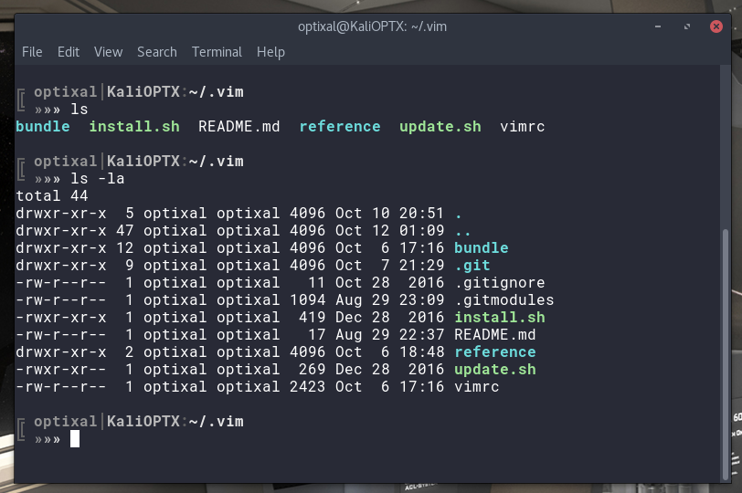
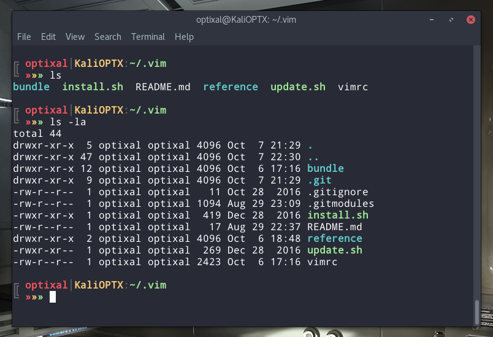
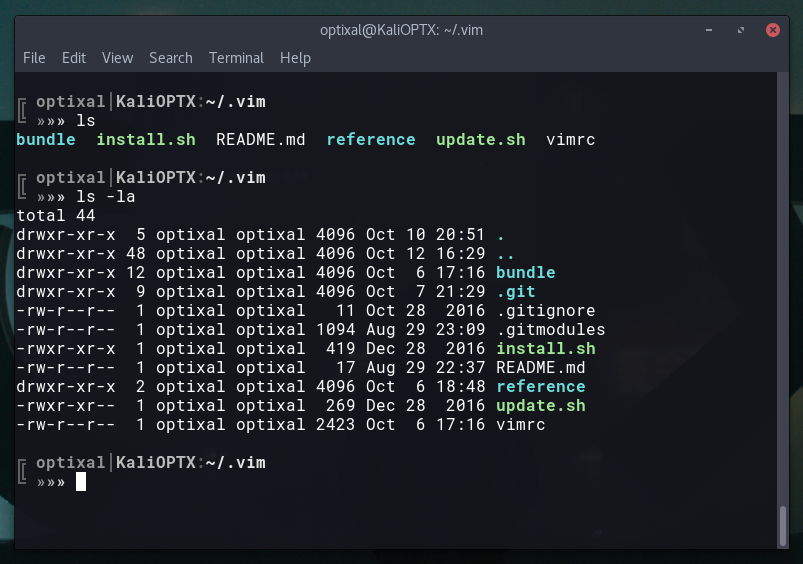
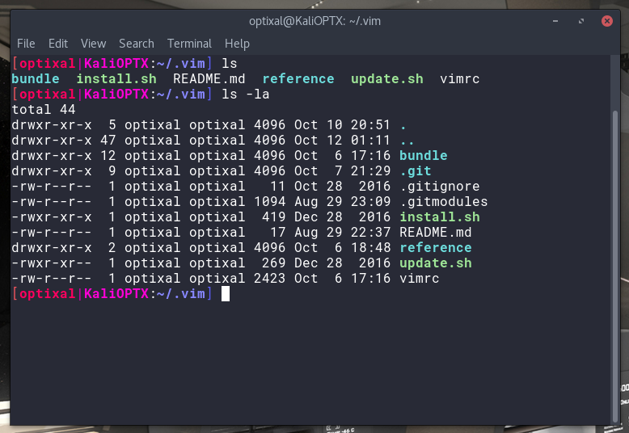

# Theme

## Monochromatic



* GTK theme - Arc Dark (https://github.com/horst3180/arc-theme)
* Terminal colors - Sublime Mariana (https://github.com/benmccormick/mariana-syntax/blob/master/styles/colors.less)
* Bashrc PS1:
    ```sh
    PS1='\n\[\033[38;5;241m\]╔ \[\033[1m\]\[\033[38;5;246m\]\u\[\033[38;5;241m\]│\[\033[38;5;250m\]\h\[\033[38;5;241m\]:\[\033[38;5;254m\]\w\[\033[0m\]\n\[\033[38;5;241m\]╚ \[\033[1m\]\[\033[38;5;246m\]»\[\033[38;5;250m\]»\[\033[38;5;254m\]»\[\033[0m\] '
    ```
* Font - Roboto Mono for Powerline Regular
* Background color - `#282A36` with 0% transparency

## Pastel



* GTK theme - Arc Dark (https://github.com/horst3180/arc-theme)
* Terminal colors - Sublime Mariana (https://github.com/benmccormick/mariana-syntax/blob/master/styles/colors.less)
* Bashrc PS1:
    ```sh
    PS1='\n\[\033[38;5;241m\]╔ \[\033[1m\]\[\033[91m\]\u\[\033[38;5;240m\]│\[\033[93m\]\h\[\033[38;5;241m\]:\[\033[92m\]\w\[\033[0m\]\n\[\033[38;5;241m\]╚ \[\033[1m\]\[\033[91m\]»\[\033[93m\]»\[\033[92m\]»\[\033[0m\] '
    ```
* Font - Droid Sans Mono for Powerline Regular
* Background color - `#282A36` with 0% transparency

## Hypebeast



* GTK theme - Arc Dark (https://github.com/horst3180/arc-theme)
* Terminal colors - Sublime Mariana (https://github.com/benmccormick/mariana-syntax/blob/master/styles/colors.less)
* Bashrc PS1:
    ```sh
    PS1='\n\[\033[38;5;241m\]╔ \[\033[1m\]\[\033[38;5;246m\]\u\[\033[38;5;241m\]│\[\033[38;5;250m\]\h\[\033[38;5;241m\]:\[\033[38;5;254m\]\w\[\033[0m\]\n\[\033[38;5;241m\]╚ \[\033[1m\]\[\033[38;5;246m\]»\[\033[38;5;250m\]»\[\033[38;5;254m\]»\[\033[0m\] '
    ```
* Font - Roboto Mono for Powerline Regular
* Background color - `#14151B` with 5~10% transparency

## Neon



* GTK theme - Arc Dark (https://github.com/horst3180/arc-theme)
* Terminal colors - Sublime Mariana (https://github.com/benmccormick/mariana-syntax/blob/master/styles/colors.less)
* Bashrc PS1:

    ```sh
    PS1='\[\033[38;5;9m\][\[\033[1m\]\[\033[38;5;197m\]\u\[\033[38;5;163m\]|\[\033[38;5;200m\]\h\[\033[0m\]:\[\033[1m\]\[\033[38;5;105m\]\w\[\033[0m\]\[\033[38;5;63m\]]\[\033[0m\] '
    ```
* Font - Roboto Mono for Powerline Regular
* Background color - `#282A36` with 0% transparency

## Complementary Add-Ons

* Vim colorscheme - Dracula (https://github.com/dracula/vim)
* Shell theme - Arctic Apricity (https://github.com/agajews/ArcticApricity)
* Wallpaper
    * Futuristic Interiors (https://siamon89.deviantart.com/gallery/)
    * Blade Runner 2049 (https://images2.alphacoders.com/870/870890.jpg)

