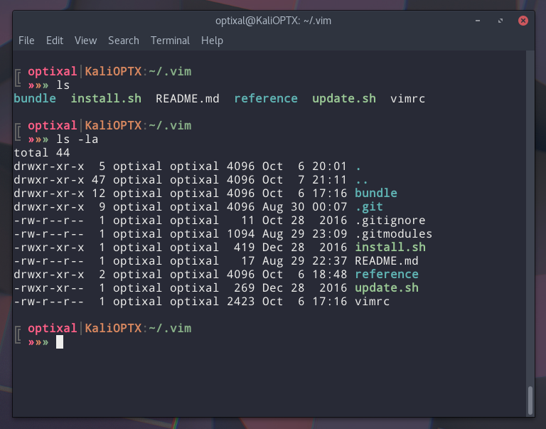

# Theme

---

* GTK theme - Arc Dark (https://github.com/horst3180/arc-theme)
* Shell theme - Arctic Apricity (https://github.com/agajews/ArcticApricity)
* Terminal colors - Sublime Mariana (https://github.com/benmccormick/mariana-syntax/blob/master/styles/colors.less)
* Bashrc PS1 - `PS1='\n\[\033[38;5;241m\]╔ \[\033[1m\]\[\033[38;5;204m\]\u\[\033[38;5;240m\]│\[\033[38;5;173m\]\h\[\033[38;5;241m\]:\[\033[38;5;108m\]\w\[\033[0m\]\[\033[38;5;241m\]\[\033[0m\]\n\[\033[38;5;241m\]╚ \[\033[1m\]\[\033[38;5;204m\]»\[\033[38;5;173m\]»\[\033[38;5;108m\]»\[\033[0m\] '`

